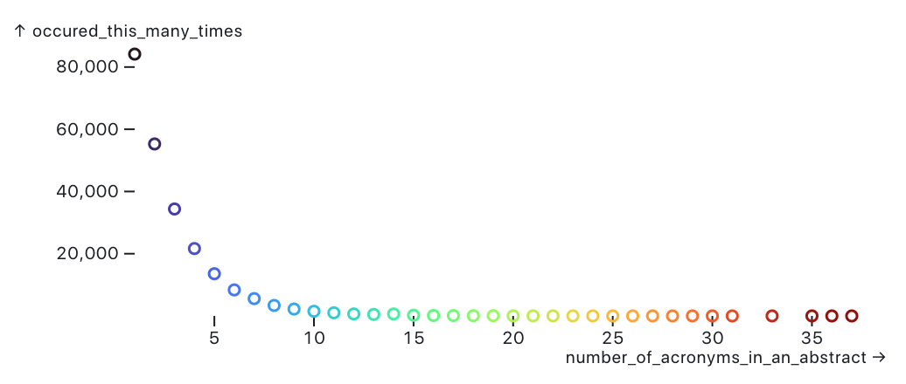
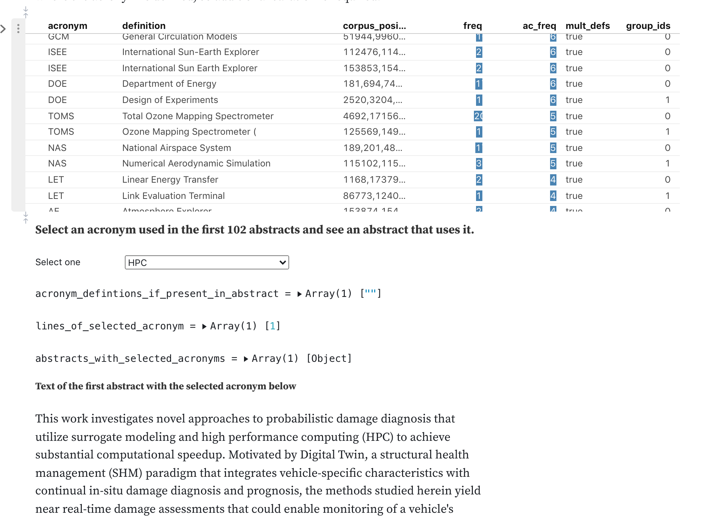

# NASA-Acronyms-in-Public-Abstracts
NASA Acronyms in Public Abstracts from data.nasa.gov

A place to put this pulic dataset https://data.nasa.gov/Raw-Data/NASA-Acronyms-in-Public-Abstracts/byqb-7uyn and play around with it

### Observable Notebook Explores Dataset

<a href="https://observablehq.com/@justingosses/exploration-of-nasa-acronyms-with-multiple-meanings">https://observablehq.com/@justingosses/exploration-of-nasa-acronyms-with-multiple-meanings</a>

